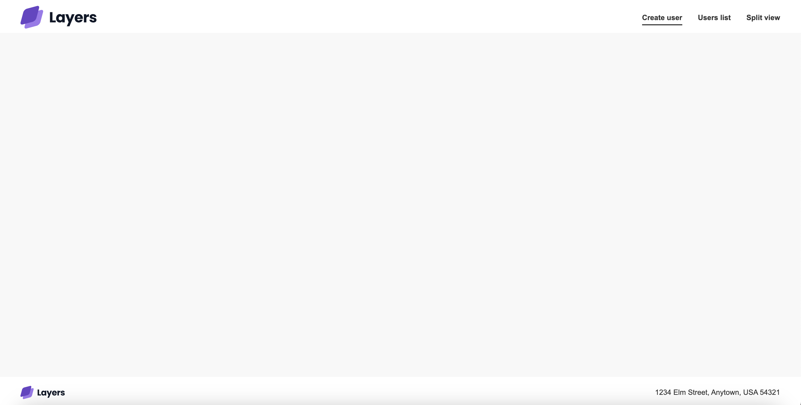
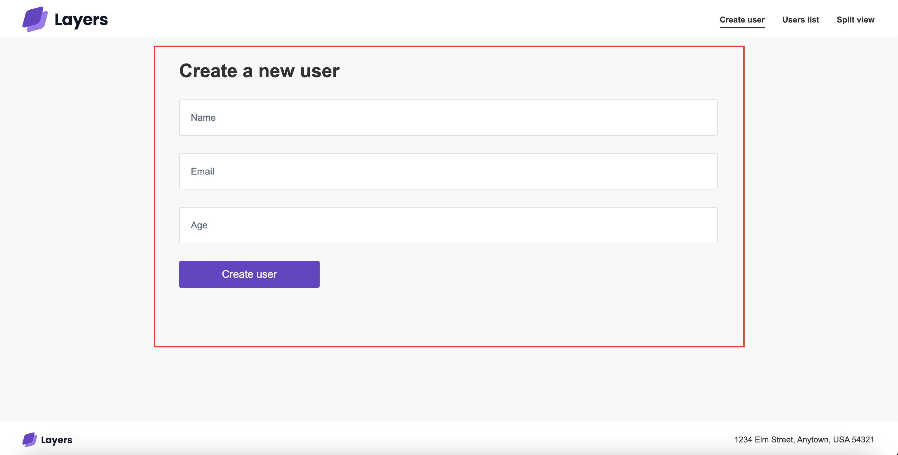
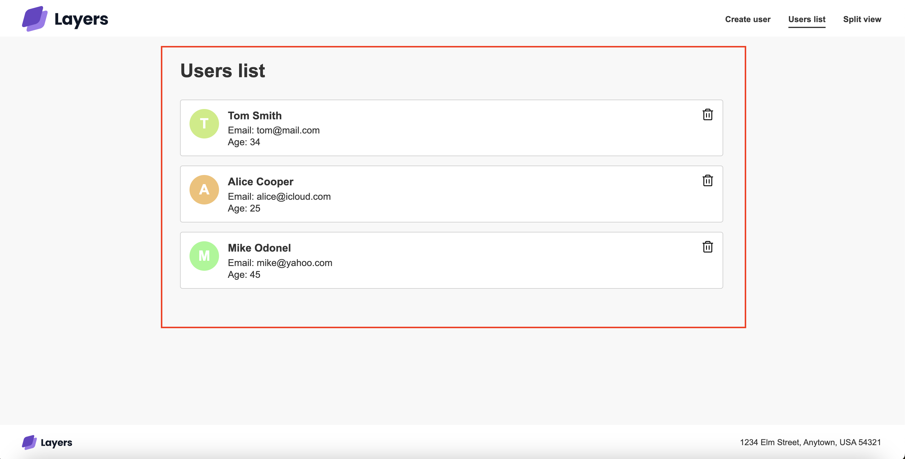
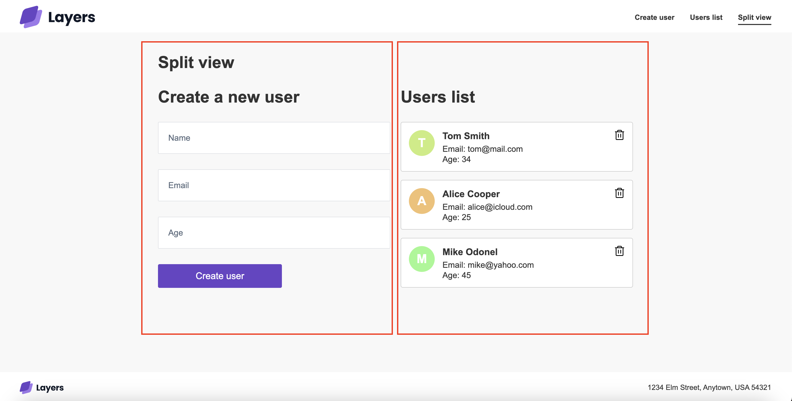

# Microfrontend React App

## Table of Contents

- [Task](#task)
- [Requirements](#requirements)
- [Installation and usage](#installation-and-usage)
- [Application overview](#application-overview)
- [Technologies](#technologies)
- [Further improvements](#further-improvements)

## Task

You are tasked with creating a way for many teams to work on the same single page web app. To
do this you are to build a microfrontend platform.

## Requirements

The application should have the following features:
- **A menu**: with links to the different microfrontends (MFE) available
- **Main area**: where the MFE renders to
- **Routing logic:** such that the MFE can be switched out without reloading.

Things to take into account:
- Create at least two microfrontends you can demonstrate switching between them.
- Using `single-spa` probably solves too much of the problem for your solution.
- Apply creative and useful approaches to the problem.
- Do not spend time on "busy work", for example, adding a few jest test-cases just because.
- Put thought into every line of code.
- Minimalism is a good thing.
- We encourage you to use the most bleeding edge functionality of the web platform (as long you
  tell us which browser to test in :)
- Feel free to try approaches which would be impractical in practice, but could be interesting from a theoretical perspective.

## Installation and usage

The project requires Node.js version 18 or higher. To install the project, follow these steps:

- `git clone git@github.com:dim2k2006/microfrontend-react-app.git`
- `cd microfrontend-react-app`
- `make install`

To run the project, use the following command:

#### Shell (host) application:

To run the project, use the following command:

- `make develop-shell`

To build the project, use the following command:

- `make build-shell`

#### User Form (remote) application:

To run the project, use the following command:

- `make develop-user-form`

To build the project, use the following command:

- `make build-user-form`

#### Users List (remote) application:

To run the project, use the following command:

- `make develop-users-list`

To build the project, use the following command:

- `make build-users-list`

### CI commands

To run linting, use the following command:

- `make lint`

To run prettier check, use the following command:

- `make prettier`

To run tests, use the following command:

- `make test`

## Application overview

The project consists of three applications:

- **Shell application**: the main application that contains the menu and the main area where the microfrontends are rendered.

- **User Form application**: the first microfrontend that contains a form to create a new user.

- **Users List application**: the second microfrontend that contains a list of created users.

The is one more screen called **Split view** that shows how two remote applications (user form and users list) can communicate in real time.

#### Links to the deployed applications

Link to the shell (host) application: https://layers-shell-host-omega.vercel.app/

Link to the user form (remote) application: https://layers-user-form-remote-ten.vercel.app/

Link to the users list (remote) application: https://layers-users-list-remote.vercel.app/

## Technologies

### Clean architecture

The project is built on two pillars: architecture and technologies.

The application is built using simple yet very powerful principles from the world of clean architecture approach (Clean Architecture: A Craftsman's Guide to Software Structure and Design by Robert Martin https://www.amazon.se/-/en/Martin-Robert/dp/0134494164).

According to these architectural principles, all implementation details are hidden behind the abstract interfaces and can be replaced at any time.

In the code, we reference only these abstract interfaces instead of concrete implementations which allows us to easily replace the implementation details without changing the core logic of the application.

Business logic is pure and does not depend on any external libraries or frameworks. All low level details depend on the business logic.

In our case we have the next structure:

- Users Repository - does depend on anything except the abstract interface.
- Users Service - depends on the Users Repository.
- Users Service Provider - depends on the Users Service.
- Users List application - depends on the Users Service Provider.
- User Form application - depends on the Users Service Provider.
- Shell application - depends on the Users Service Provider.

### Build system

To effectively implement the above principles, I used very powerful build tool called NX https://github.com/nrwl/nx.

With NX, we can easily create a monorepo with multiple applications and libraries. It allows us to share code between applications and libraries, and to build, test, and deploy them in a very efficient way.

NX also provides use with very useful eslint rule called *enforce-module-boundaries* that allows us to define the rules for the dependencies between the applications and libraries to be able to follow the clean architecture principles.

Finally, NX has out of the box tools for building microfrontends using webpack module federation plugin.

